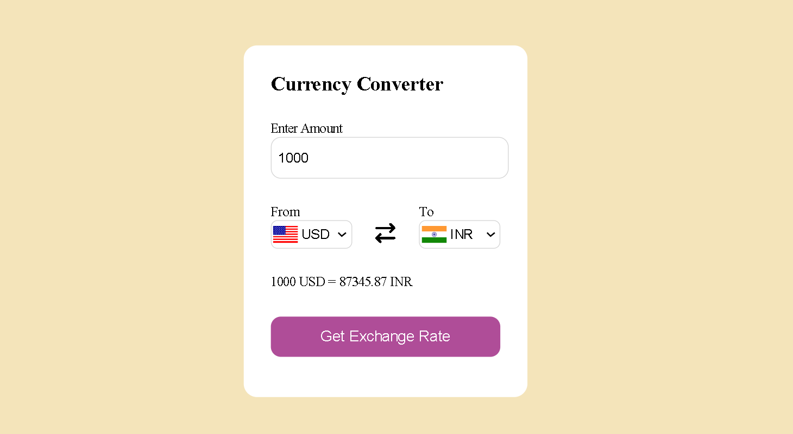

# 💱 Currency Converter – Web App

A simple and interactive **Currency Converter** built using **HTML, CSS, and JavaScript**.  
Easily convert amounts between different currencies using real-time exchange rates.  
Designed with a clean UI and instant conversion results.  

## 🔗 Live Demo
👉 [Try Currency Converter Here]( https://sahanahc123.github.io/Currency-Converter/)  

## 🕹️ Features
- 🔄 Convert between multiple currencies (USD, EUR, INR, GBP, JPY, etc.)  
- 🌍 Real-time exchange rates using an API  
- ✅ Instant conversion result display  
- 📱 Responsive design (works on desktop and mobile)  
- 🎨 Simple and clean visual design  

## 🛠️ Tech Stack
- **HTML**  
- **CSS**  
- **JavaScript**  
- **Exchange Rate API** (e.g., [ExchangeRate-API](https://www.exchangerate-api.com/))  

## 📖 How to Use
1. Open the application in your browser.  
2. Enter the **amount** you want to convert.  
3. Select the **From Currency** (e.g., USD).  
4. Select the **To Currency** (e.g., INR).  
5. Click the **Convert** button.  
6. The converted result will be displayed instantly.  
7. To reset, simply change the values or refresh the page.  

## 📸 Screenshots

### 💱 Converter UI  
  

[GitHub Repo](https://github.com/sahanahc123/Currency-Converter)

Made with ❤️ by [Sahana HC](https://github.com/sahanahc123)